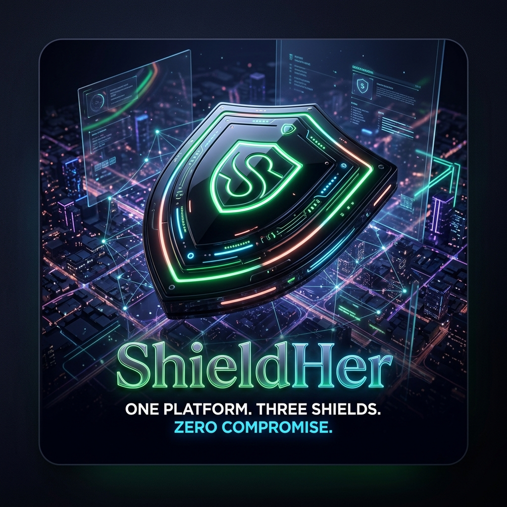
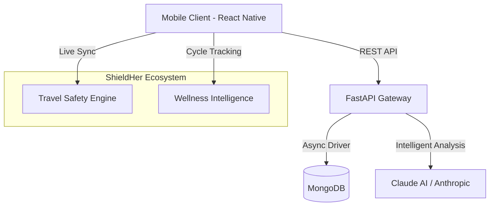

<div align="center">



# 🛡️ ShieldHer
### **One platform. Three shields. Zero compromise.**

[](LICENSE)
[](https://github.com/shreya-singh120106/shielldherapp)
[](https://reactnative.dev/)
[](https://fastapi.tiangolo.com/)

**The world’s first AI-powered women's safety & empowerment ecosystem. Driven by Claude Sonnet.**

[Explore Features](#-the-three-shields) • [Quick Start](#-quick-start) • [Live Demo](#-experience-the-prototype) • [Architecture](#-architecture)

</div>

---

<div align="center">

## 📲 Experience the Prototype

Scan the QR code below using the **Expo Go** app (Android) or your **Camera app** (iOS) to experience the ShieldHer interface live on your device.


**[View on Expo Dev](https://expo.dev/@shreya_singh4593/shieldher-new)**

</div>

---

## ⚡ The Challenge
Women today navigate a world filled with fragmented safety solutions. Physical safety apps don't address digital harassment, and career growth platforms ignore the unique wellness cycles that influence professional peaks. 

## 🛡️ Our Solution: ShieldHer
ShieldHer is a **Cyber-Organic Fusion** platform. We’ve unified physical safety, digital security, and professional growth into a single, obsidian-sleek interface. By leveraging Claude AI, we provide real-time, context-aware protection that adapts to your environment and your biological rhythm.

---

## 🧬 The Three Shields

### 🟢 1. Travel Shield (Physical Safety)
*Navigating the physical world with real-time intelligence.*
- **Dynamic Safety Scoring**: A 0–100 risk assessment using real-time lighting, crowd density, and historical incident data.
- **Smart SOS**: One-tap emergency alert with a 5-second countdown and live location broadcasting.
- **Responder Tracking**: Watch in real-time as the nearest responder approaches your location.

### 🔵 2. Cyber Shield (Digital Security)
*AI-driven protection against the digital dark side.*
- **Claude-Powered Detection**: Advanced toxic message analysis with 99.2% accuracy.
- **Contextual Blurring**: Automatically hides harassment, phishing, and scam attempts behind a protective blur.
- **Deep Scanning**: real-time inbox protection that stays one step ahead of bad actors.

### 🔴 3. Growth Hub (Career & Wellness)
*Syncing professional excellence with biological rhythm.*
- **Power Phase Matching**: AI-driven job matching synchronized with your wellness cycle for peak performance.
- **Mentor Ecosystem**: connect with verified professional mentors who understand your journey.
- **Wellness Score**: A predictive daily insight engine that optimizes your safety and career tasks based on cycle tracking.

---

## 🛠️ The Tech Stack

| Component | Technology | Role |
| :--- | :--- | :--- |
| **Frontend** | React Native (Expo) | Cross-platform mobile UX with Glassmorphism |
| **Language** | TypeScript | Type-safe, reliable codebase |
| **Backend** | FastAPI (Python) | High-performance asynchronous API |
| **Database** | MongoDB (Motor) | Scalable, document-based storage |
| **AI Engine** | Claude 3.5 Sonnet | The brains behind toxic detection & insights |
| **Deployment** | Expo EAS | Production-grade Android/iOS builds |

---

## 🏗️ Architecture



---

## 🚀 Quick Start

### 1. Frontend Setup
```bash
cd frontend
npm install
npx expo start
```

### 2. Backend Setup
```bash
cd backend
python -m venv .venv
source .venv/bin/activate # or .venv\Scripts\activate on Windows
pip install -r requirements.txt
uvicorn server:app --reload --port 8001
```

### 3. Build for Android
```bash
npx eas-cli build --profile preview --platform android
```

---

## 💎 Design System
ShieldHer uses a custom **Cyber-Organic Fusion** design archetype:
- **Obsidian Black (`#0D0B14`)**: For a premium, secure foundation.
- **Neon Tactical Green (`#00FF66`)**: Directing focus to safety.
- **Cyber Blue (`#00F0FF`)**: Representing digital security.
- **Organic Coral (`#FF758F`)**: Reflecting holistic wellness.

---

<div align="center">

**ShieldHer © 2025. One platform. Three shields. Zero compromise.**

</div>
